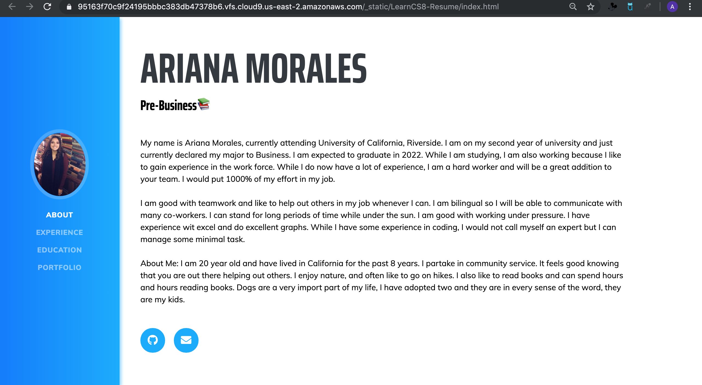

# Ariana Morales - Resume Website 
## Pre-Business 

My name is Ariana Morales, currently attending University of California, Riverside. I am on my second year of university and just currently declared my major to Business. I am expected to graduate in 2022. While I am studying, I am also working because I like to gain experience in the work force. While I do now have a lot of experience, I am a hard worker and will be a great addition to your team. I would put 1000% of my effort in my job.  
  
I am good with teamwork and like to help out others in my job whenever I can. I am bilingual so I will be able to communicate with many co-workers. I can stand for long periods of time while under the sun. I am good with working under pressure. I have experience wit excel and do excellent graphs While I have some experience in coding, I would not call myself an expert but I can manage some minimal task.  
  
About Me: I am 20 year old and have lived in California for the past 8 years. I partake in community service. It feels good knowing that you are out there helping out others. I enjoy nature, and often like to go on hikes. I also like to read books and can spend hours and hours reading books. Dogs are a very import part of my life, I have adopted two and they are in every sense of the word, they are my kids.

# Experience
## Tutoring
### Serrano Elementary School
• Helping out first graders do their work  
• Responsible for Reading Time
April 2019 - Present

## Cashier
### WashBank Express Carwash
• Responsible for closing and opening Helping out with first graders do their work  
• Needed to check out customers for their carwash  
• Responsible for stocking up
July 2019 - October 2019

## Babysitter
### SHELLA Care

• Responsible for taking care of kids  
• Had to feed them and bather them
	May 2018 - April 2019

# Education
## UC Riverside 
### Pre-Business

can sync one file with multiple locations and accounts.
# Portafolio 

